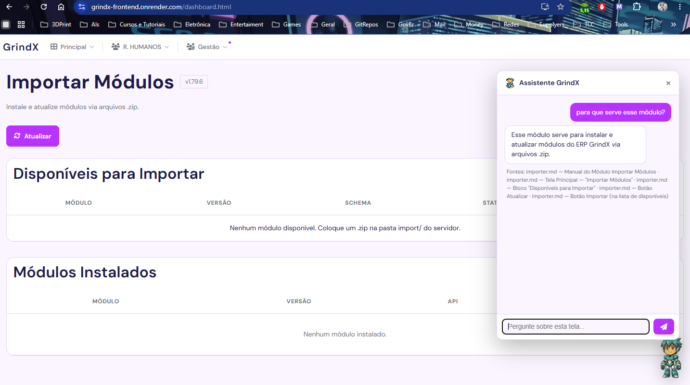

<!-- title: GrindX — Sistema de Gestão Integrado | updated: 2026-08-14 -->

# GrindX — Sistema de Gestão Integrado (Monorepo)

O **GrindX** é um ERP modular construído com arquitetura de monorepo, focado em escalabilidade, segurança e experiência do usuário premium. Suporta **PWA** (instalável como app) e **HTTPS** em desenvolvimento e produção.

---

## Status do Projeto

Projeto em desenvolvimento ativo. Funcionalidades principais implementadas e funcionais (autenticação JWT + RBAC, CRUD de usuários, portal modular com shell, skin system com dual layout, importação de módulos). CI/CD, testes automatizados (264) e documentação acompanham o desenvolvimento.

---

## Arquitetura

O projeto utiliza micro-serviços no backend e um Portal Orquestrador (Shell) no frontend.

### Backend

- **`api-postgres` (porta 8002):** API principal em FastAPI. Gerencia autenticação JWT, RBAC, usuários, temas/skins, estrutura do portal e importação de módulos.
- **`api-sqlserver` (porta 8001):** API somente leitura para integração com bases SQL Server legadas (Protheus). Endpoints: `/health`, `/v1/produtos/por-codigo`, `/v1/produtos/por-descricao`. Endpoints públicos (sem validação JWT).
- **`agente-ia` (porta 8003):** Agente de IA (RAG) — assistente de manuais. Responde dúvidas dos colaboradores sobre como usar os módulos (DeepSeek + sentence-transformers + pgvector). Endpoints: `/health`, `/v1/agente/chat`, `/v1/agente/manuais`, `/v1/agente/modulos`.
- **`shared`:** Pacote Python compartilhado entre as APIs — segurança, schemas e exceções.

### Frontend

- **Portal Modular (porta 8101):** Shell que gerencia navegação e carrega módulos via iframe isolado. **PWA-ready** (service worker, manifest com ícones 192x192 e 512x512, `display: standalone`). Preparado para reverse proxy (nginx) com same-origin API, CSP estático e HTTPS.
- **Módulos:** `admin-skins`, `admins`, `auditoria`, `home`, `importer`, `profile`, `structure`, `users` — cada um é standalone e testável independentemente.
- **Inatividade:** `shared/inactivity.js` — sistema de inatividade com logout automático; `shared/serverLogout.js` notifica a API no logout manual e por inatividade (`POST /v1/auth/logout`).
- **Design System:** Glassmorphism + tokens CSS + `UIFactory` para consistência absoluta.

---

## Como Rodar

### Pré-requisitos

- Python 3.12+
- PostgreSQL rodando localmente
- ODBC Driver 17 for SQL Server ou FreeTDS (apenas para `api-sqlserver`)

### Setup Inicial

```powershell
# 1. Clonar
git clone <url> && cd GrindX

# 2. Criar virtualenv e instalar dependências — api-postgres
cd apps/api-postgres
python -m venv .venv && .\.venv\Scripts\activate
pip install -r requirements.txt

# 3. Configurar banco
copy .env.example .env   # editar DATABASE_URL e SECRET_KEY

# 4. Rodar migrações e popular dados iniciais
make migrate   # alembic upgrade head (cria todas as tabelas)
make seed      # popula admin, empresa, skin, abas, módulos
```

```powershell
# 5. Rodar APIs (terminais separados)
make dev-postgres    # porta 8002
make dev-sqlserver   # porta 8001

# 6. Rodar frontend
python -m http.server 8101 --directory apps/frontend-webapp
```

Acesse em `http://localhost:8101`.

### HTTPS (Desenvolvimento Local)

```bash
# 1. Instalar mkcert (uma vez)
# Windows: winget install mkcert
# Linux:   sudo apt install libnss3-tools && sudo mkcert -install

# 2. Gerar certificados
mkcert -key-file .certs/dev-key.pem -cert-file .certs/dev-cert.pem localhost 127.0.0.1 ::1

# 3. Rodar tudo com HTTPS
make dev-https
```

Acesse frontend em `https://localhost:8443` e API em `https://localhost:8002/v1/docs`.

### Credenciais de Teste

| Usuário | Senha | Perfil |
|---------|-------|--------|
| `admin` | `admin123` | Administrador |

---

## Agente de IA (assistente de manuais)

O **Agente de IA** (`apps/agente-ia`) é um assistente RAG que responde dúvidas sobre **como usar os módulos**, com base nos manuais/documentos (Markdown ou CSV) indexados. Acessível pelo **mascote flutuante** no dashboard ou pela API (`http://localhost:8003/v1`). A ingestão é feita pelo módulo **Gestão → Configurar Agente**.

**Exemplo de pergunta:** *O que faz o botão Salvar no cadastro de usuário?*
**Resposta:** "O botão Salvar grava o novo usuário, fecha a janela e atualiza a tabela. Se algum campo obrigatório estiver errado, aparece um aviso explicando o que corrigir e a janela não fecha."

**Exemplo de pergunta:** *Como desativo um usuário?*
**Resposta:** "Na coluna Status, clique no selo **Ativo**. A mensagem 'Usuário desativado com sucesso' aparece e o selo muda para **Inativo** — a pessoa deixa de acessar o sistema."

Mais exemplos de perguntas e respostas, arquitetura e instruções em [`apps/agente-ia/README.md`](apps/agente-ia/README.md).

---

## Deploy na nuvem — Evidência

O agente está implantado na nuvem e acessível publicamente.

- **Agente de IA:** https://agente-ia-gexd.onrender.com
- **Swagger do agente:** https://agente-ia-gexd.onrender.com/v1/docs
- **API Postgres (ERP):** https://api-postgres-jc35.onrender.com
- **Frontend (GrindX):** https://grindx-frontend.onrender.com
- **Banco:** Supabase (PostgreSQL + pgvector)
- **Serviço OCI:** OCI Object Storage (bucket com os manuais de origem)

**Imagem/vídeo do agente em execução na nuvem:**



> Requisito do desafio: "Inserir no README uma imagem ou vídeo do agente executando em nuvem (OCI ou outro serviço online)".

---

## Testes

Suite com 264 testes cobrindo unitários, integração e validação do monorepo.

| Pacote | Testes | Cobertura |
|--------|--------|-----------|
| `api-postgres` | 197 | Auth, RBAC, temas, usuários, portal, segurança, cache, importação, PDF |
| `api-sqlserver` | 17 | Health check e consulta de produtos Protheus |
| `shared` | 26 | Permissões RBAC |
| `tests/` (raiz) | 24 | Validação de pacotes e JWT cross-API |

```powershell
make test-postgres    # somente api-postgres
make test-sqlserver   # somente api-sqlserver
make test-shared      # somente shared
make test-root        # testes da raiz
make test-all         # todos os pacotes
```

---

## CI/CD

Workflow único em `.github/workflows/release.yml`:

- **`test-api-postgres`** — 197 testes com SQLite in-memory, cobertura mínima 70%
- **`test-api-sqlserver`** — testes com SQLite via `DB_URL_OVERRIDE`
- **`test-root`** — testes do monorepo (depende dos dois anteriores)
- **`lint`** — `ruff check` + `ruff format --check` em `packages/` e `apps/`
- **`release`** — `python-semantic-release` com publicação no GitHub (apenas push para `main`)

---

## Documentação

Portal de entrada: [`docs/README.md`](docs/README.md)

| Documento | Conteúdo |
|-----------|----------|
| [`docs/API.md`](docs/API.md) | Referência completa dos endpoints REST |
| [`docs/SETUP.md`](docs/SETUP.md) | Guia detalhado de instalação |
| [`docs/DEPLOYMENT.md`](docs/DEPLOYMENT.md) | Instruções de deploy com containers |
| [`docs/DATABASE.md`](docs/DATABASE.md) | Schema, modelos e migrações |
| [`docs/SECURITY.md`](docs/SECURITY.md) | Autenticação JWT e RBAC |
| [`docs/SKILLS.md`](docs/SKILLS.md) | Skills do assistente |
| [`docs/MAPA-ARQUIVOS.md`](docs/MAPA-ARQUIVOS.md) | Inventário completo de arquivos |

---

## Design System

- **Glassmorphism** com tokens CSS centralizados em `shared/core.css`
- **`UIFactory`** (`shared/app.js`) para criação programática de componentes
- **Componentes:** `FormField`, `DataTable`, `ReusableModal`, `LoadingSpinner`
- **Skin system:** tema visual customizável por empresa, aplicado via `skinLoader.js`
- **Dual layout:** `topbar` (padrão) e `sidebar` — configurável por tema
- **Dark/Light mode** com persistência via `localStorage` + banco de dados (preferência do usuário)
- **Fluxo de forgot-password** com envio de email e troca de senha
- **Utilitários:** `apiService.js` (chamadas centralizadas com auto-auth), `validation.js` (validação de formulários e URLs)
- **WCAG** — acessibilidade como primeira camada

---

## Estrutura de Pastas

```
GrindX/
├── .github/workflows/
│   └── release.yml            # CI/CD completo (testes + lint + semantic release)
├── docs/                      # Documentação técnica
│   ├── README.md              # Portal de entrada
│   ├── API.md
│   ├── SETUP.md
│   ├── DEPLOYMENT.md
│   ├── DATABASE.md
│   ├── SECURITY.md
│   ├── SKILLS.md
│   └── MAPA-ARQUIVOS.md
├── apps/
│   ├── api-postgres/          # API principal (FastAPI + PostgreSQL)
│   │   ├── app/
│   │   │   ├── auth/          # JWT — router, service, dependencies
│   │   │   ├── core/          # config, exceptions, logging, versioning, cache
│   │   │   ├── middleware/    # rate limit, request id, security headers
│   │   │   ├── modules/       # Modelos por schema (iam, portal, org)
│   │   │   ├── models/        # Re-export shims (compatibilidade)
│   │   │   ├── repositories/
│   │   │   ├── routers/       # auth, health, portal, proxies, theme, usuario, import, audit
│   │   │   ├── schemas/
│   │   │   └── services/      # email, theme, usuario
│   │   ├── audit/             # Auditoria de alterações e sessões (models, service, listeners, router)
│   │   ├── alembic/           # 22 migrações do banco
│   │   ├── tests/             # 216 testes
│   │   └── ...
│   ├── api-sqlserver/         # API somente leitura (SQL Server)
│   │   ├── app/
│   │   │   ├── auth/          # Validação JWT (sem emissão)
│   │   │   ├── core/
│   │   │   ├── middleware/
│   │   │   ├── routers/       # protheus, health
│   │   │   └── services/
│   │   ├── tests/
│   │   └── ...
│   ├── agente-ia/             # Agente de IA (RAG) — assistente de manuais
│   │   ├── app/               # FastAPI: rag (ingestion, embeddings, vectorstore, retrieval, generation), routers
│   │   ├── manuals/           # Manuais Markdown dos módulos
│   │   └── tests/
│   └── frontend-webapp/       # Portal Frontend
│       ├── index.html         # Login
│       ├── dashboard.html     # Shell principal
│       ├── widget/            # Mascote do agente (chat nativo)
│       ├── modules/           # admin-skins, admins, auditoria, configurar-agente, home, importer, profile, structure, users
│       └── shared/            # Design System + Core Framework
├── packages/
│   └── shared/                # Pacote Python compartilhado
│       ├── security/          # JWT e bcrypt
│       ├── schemas/           # Schemas base (auth, error codes)
│       └── exceptions/        # Exceções customizadas + códigos de erro
├── tests/                     # Testes do monorepo (raiz)
├── Makefile                   # Automação de tasks
├── compose.yaml                # Orquestração Podman
├── AGENTS.md                   # Convenções do assistente
└── pytest.ini                 # Configuração de testes
```

---

Desenvolvido com foco em **SOLID**, **Clean Code** e **Performance**.

Toda alteração deve passar por `ruff format`, `ruff check` e `make test-all` antes do push.

---
## License

This project is licensed under the MIT License - see the [LICENSE](LICENSE) file for details.
